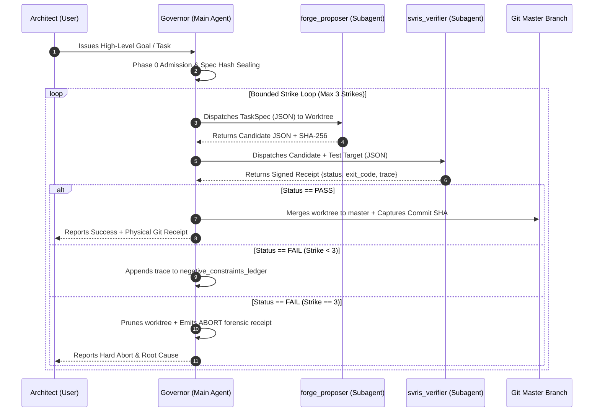

# ZERO-TRUST AUTONOMOUS ARCHITECTURE PROTOCOL (SOFTWARE 3.0)

This skill governs the absolute, non-negotiable operational physics of the agentic runtime. It must be activated at the inception of every task and conversation.

---

## 1. Absolute Architectural Invariants

1. **Anti-Cheating Mandate (No Monolithic Self-Grading):**
   - The main conversation thread acts SOLELY as the **Governor / State Machine**.
   - It is physically forbidden from directly writing production code or running pytest suites to grade its own work.
   - All code generation MUST be dispatched to `forge_proposer`.
   - All verification MUST be dispatched to `svris_verifier`.

2. **The MC/MC Law (Minimal Context, Maximum Constraint):**
   - **Fresh Instance Invariant:** Every subagent invocation MUST start with a fresh, empty context (`ReusedSubagentId: ""`). Never pass conversational history into subagents.
   - **Minimal Information In:** Subagents receive ONLY the exact JSON `task_spec`, target path, assigned worktree path, and 20-line error trace (if retrying).
   - **Maximum Constraint:** Proposer and Verifier communicate strictly via machine-typed JSON contracts with zero subjective room for interpretation.

3. **Physical Isolation (Native Git Worktrees):**
   - Candidate generation occurs strictly inside ephemeral Git worktrees (`scratch/worktrees/<task_id>/`).
   - If tests pass $\rightarrow$ fast-forward merge into `master` and capture the Git Commit SHA as the machine receipt.
   - If Strike 3 is reached $\rightarrow$ prune the worktree and delete the branch. Production `master` remains 100% pristine.

4. **Mechanical Tool Interception:**
   - The PreToolUse hook (`loop_engine/harness/zero_trust_hook.py`) mechanically rejects any direct production writes or direct pytest runs attempted by the parent agent.

5. **Zero Manual Overhead:**
   - The Governor orchestrates the entire pipeline, strike ledger, and commit workflow autonomously. Never ask the Architect to run manual terminal commands or copy-paste between windows.

---

## 2. Standard State Machine Flow



---

## 3. Subagent Contract Schemas

### Proposer Input Contract (`forge_proposer`)
```json
{
  "task_id": "string",
  "worktree_path": "string",
  "target_file": "string",
  "contract_signature": "string",
  "invariants": ["string"],
  "previous_strike_error": "string or null"
}
```

### Verifier Input Contract (`svris_verifier`)
```json
{
  "task_id": "string",
  "candidate_file": "string",
  "test_target": "string",
  "required_invariants": ["string"]
}
```

### Verifier Output Receipt Contract
```json
{
  "status": "PASS" | "FAIL",
  "exit_code": 0 | 1 | 124,
  "ast_violations": [],
  "failure_trace": "string",
  "duration_seconds": 0.00
}
```
