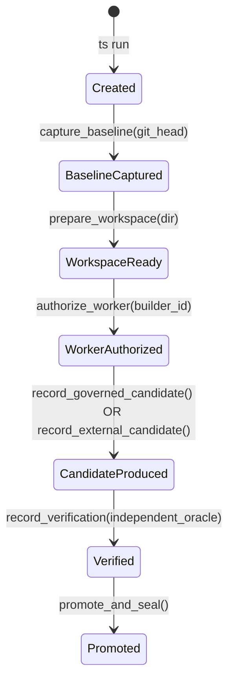

# ADR-001: Polyglot Architecture & Rust Trusted Kernel for Ten Shadows

**Status**: APPROVED & IMPLEMENTED  
**Date**: 2026-08-28  
**Context**: Forensic audit of JobHunter run exposed an authority failure where external models modified git trees directly and only invoked Ten Shadows post-hoc.

---

## 1. Problem Statement & First Principle

**The Axiom**:
> *"The model may decide what to attempt. The Shadow may decide how to attempt it. Only the trusted Ten Shadows Core may decide what becomes an authoritative Ten Shadows result."*

In Python, runtime memory and state objects can be bypassed: any external process could write files directly, commit to git, and subsequently invoke an audit wrapper that produced a `VERIFIED_SUCCESS` receipt for an external candidate.

To guarantee that Ten Shadows is an **executable technique** rather than a **behavioral convention followed by an AI**, the authority boundaries must be enforced mechanically by a compiled Trusted Computing Base (TCB).

---

## 2. Polyglot Language-Fit Matrix

| Subsystem | Dominant Concern | Recommended Runtime | Migration Decision | Rationale |
| :--- | :--- | :--- | :--- | :--- |
| **Ingress & CLI Dispatcher (`ts`)** | Ingress security, CLI speed, process startup | **Rust** | **MIGRATE** | Standalone binary guarantees un-monkeypatchable entry point and fast execution. |
| **Trusted Kernel Core & State Machine** | Authority, state transitions, TCB invariants | **Rust** | **MIGRATE** | Rust's typestate pattern makes illegal lifecycle states unrepresentable at compile time. |
| **Candidate Lineage & Custody Guard** | Physical provenance tracking | **Rust** | **MIGRATE** | Cryptographic hashing, strict ownership, and deterministic candidate classification. |
| **WAL & Storage Authority** | Transactional integrity, immutable receipts | **Rust / Pure WAL** | **SPLIT** | Rust kernel owns append-only write authority; Python retains read-only audit client. |
| **Subprocess Verification Gate** | Process containment, test oracle execution | **Rust Harness** | **SPLIT** | Rust kernel manages timeout, environment ring-fencing, and exit code capture; domain test runners (pytest, cargo, npm) execute targets. |
| **Shadow 1 (Forge - Planning & AST)** | Prompt synthesis, LLM experimentation, AST manipulation | **Python** | **KEEP** | AI SDK ecosystem and rapid prompt iteration are optimal in Python; Forge is untrusted by design. |
| **Shadow 2 (SVRIS - Test Oracle Specs)** | Test discovery, dynamic property generation | **Python** | **KEEP** | Dynamic test harness synthesis in Python, executed under Rust subprocess supervision. |
| **Shadow 3 (Adversarial Auditor)** | Dynamic AST security scanning | **Python** | **KEEP** | AST inspection tools are mature and expressive in Python. |
| **Shadow Protocol (Worker IPC)** | Language-agnostic worker isolation | **JSON-RPC / stdio** | **NEW** | Standardized stdin/stdout JSON protocol connects Rust kernel to polyglot workers. |

---

## 3. Typestate State Machine Lifecycle

The Rust kernel implements strict compile-time typestates:



Each state transition consumes the previous struct via affine move semantics, preventing out-of-order execution or retroactive forgery.

---

## 4. GovernedCandidate vs. ExternalCandidate Custody

```
                                  [Candidate Code]
                                         |
             +---------------------------+---------------------------+
             |                                                       |
   [GovernedCandidate]                                     [ExternalCandidate]
- Captured from Kernel Workspace                        - Imported / Pre-existing on disk
- Authorized Worker Invocation                          - Post-hoc audit or untracked edit
- Verified Baseline Lineage                             - Missing Ingress Lineage
             |                                                       |
    Independent Oracle                                      Independent Oracle
             |                                                       |
[Verified<GovernedCandidate>]                           [Verified<ExternalCandidate>]
             |                                                       |
is_ten_shadows_execution: TRUE                          is_ten_shadows_execution: TRUE
is_ten_shadows_production: TRUE                         is_ten_shadows_production: FALSE
```

---

## 5. The Four Substrate Laws (Enforced in Rust)

1. **Law 1 (Authority)**: Only the trusted kernel creates authoritative execution runs and seals cryptographic receipts.
2. **Law 2 (Provenance)**: Every consequential claim retains unbroken causal lineage (`parent_baseline_sha` -> `workspace_id` -> `worker_invocation_id` -> `candidate_sha`).
3. **Law 3 (Independence)**: The worker path producing a candidate cannot certify that candidate (`builder_id != verifier_id`).
4. **Law 4 (Evidence Monotonicity)**: Weaker evidence modalities cannot be upgraded to stronger modalities (`SIMULATED < STRUCTURAL < DETERMINISTIC_TEST < INTEGRATION < EMPIRICAL`).

---

## 6. Physical Test Verification Results

- **Rust Adversarial Test Suite**: 10/10 tests passing in `crates/ten_shadows_kernel/tests/adversarial_authority_tests.rs`.
- **Python Execution Authority Suite**: 14/14 tests passing in `tests/test_mandatory_execution_authority.py`.
- **Standalone CLI Verification**: `ts run`, `ts verify-receipt`, and `ts verify-production` verified mechanically on live workspace.
