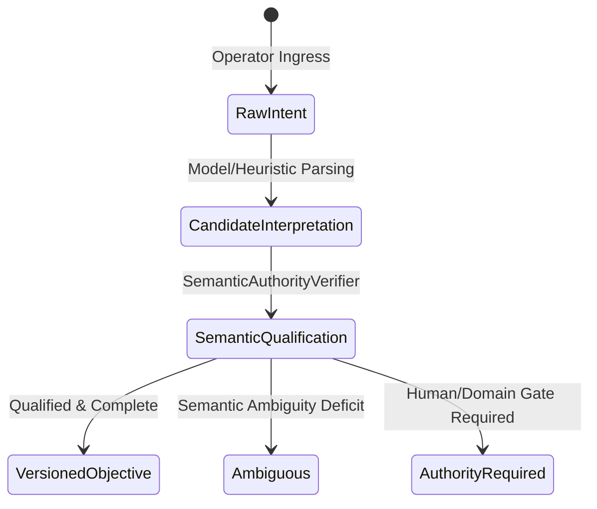

# ADR-002: Constitutional Foundations, Objective Lifecycle, and Law 6 Sufficiency

**Status**: APPROVED & IMPLEMENTED  
**Date**: 2026-08-28  
**Context**: Forensic audit of Law 6 attempt revealed semantic authority duplication, 0-obligation false-success exploits, string-based entailment heuristics, and disconnected epistemic qualification.

---

## 1. Problem Statement & First Principles

### The Core Failure Modes:
1. **Parallel Semantic Authority**: Disconnected constitutional structures in `crates/ten_shadows_kernel/src/constitution.rs` and `loop_engine/constitution/schema.py` bypassed Forge's authoritative semantic contracts and proof verifier.
2. **0-Obligation Exploit**: A non-trivial objective with an empty obligation set evaluated to `is_sufficient: true` because `unresolved_mandatory.is_empty()` was trivially true.
3. **String/Label Entailment Collapse**: Evidence entailment evaluated `tested_effect == required_effect` or `execution_trace.contains(...)`, allowing arbitrary passing tests to masquerade as semantic accomplishment.
4. **Epistemic Dimension Overloading**: Modal, epistemic, reachability, and governance states were collapsed into single booleans or undifferentiated enums.

---

## 2. Definitive Architecture Ownership Map

| Responsibility | Authoritative Owner | Non-Authoritative / Untrusted | Invariant |
| :--- | :--- | :--- | :--- |
| **Semantic Interpretation & Adequacy** | `Forge/core/` (`substrate.py`, `obligations.py`, `adequacy.py`) | Model proposals, worker metadata | Raw intent must undergo semantic qualification. Requirements cannot self-author. |
| **Sovereign Execution & Custody** | `ten_shadows_kernel` (Rust Core v3.0) | Python workers, external scripts | All mutations must occur inside ring-fenced `GovernedWorkspace` off verified baseline. |
| **Epistemic Qualification & Evidence** | `loop_engine/constitution/evidence.py` | Test pass status, worker self-assertions | Evidence is relational: $O$ supports $C$ under $K$ using $Q$ within $S$ at $T$ against $V$. |
| **Relational System & Invalidation** | `loop_engine/relational/` (JTMS) | Graph edges (cannot manufacture truth) | Evidence retraction cascades and reopens dependent requirements/objectives. |
| **Objective Sufficiency (Law 6)** | Unified Law 6 Engine (`predicate.rs`, `lifecycle.py`) | Individual component success | Higher-order completion requires qualified completeness + satisfied mandatory obligations + valid composition. |

---

## 3. Objective Lifecycle & Revision Semantics

Objectives progress through explicit versioned stages:

### Versioning Invariants:
- Objectives are immutable value objects identified by `objective_id` and `version` (e.g. `v1.0.0`).
- Revisions produce new child specifications linked via `parent_version` and `revision_type` (`CLARIFICATION`, `REQUIREMENT_ADDITION`, `SCOPE_EXPANSION`, `CONSTRAINT_CHANGE`).
- Revision triggers automatic re-qualification of prior evidence and satisfaction claims.

---

## 4. Requirement Completeness & Composition Semantics

- **Separation of Concerns**:
  - `RequirementSetCompleteness`: Evaluates whether the derived requirements adequately cover the canonical intent without unaccounted drops or unauthorized assumptions.
  - `RequirementSatisfaction`: Evaluates whether qualified evidence supports the required claims.
- **Completeness Invariant**: A non-trivial objective with `obligations = []` evaluates to `UNRESOLVED_COVERAGE` and fails closed.
- **Composition Invariant**: Logical operators (`AND`, `OR`, `CONDITIONAL`) are grounded in the authoritative objective semantics; workers cannot weaken `MANDATORY_CONJUNCTION` into disjunctions.

---

## 5. Relational Evidence & Bounded Verifiers

- **Elimination of String Matching**: No `contains(...)` or `tested_effect == required_effect` heuristics.
- **Bounded Verification Contract**: Verifiers declare what claim they test, what observation they produced, what modality they establish, and what they do NOT establish.
- **Independence Gate**: $Builder \neq Verifier$ enforced at both process and token levels.

---

## 6. Success Decomposition

Receipts and predicates separate evaluation into strictly independent dimensions:

1. `is_execution_valid`: Protocol signature, DB anchor, verifier independence.
2. `is_production_valid` (Law 5): Governed candidate lineage, baseline match, $\Delta > 0$ mutations.
3. `is_requirement_set_complete`: Semantic adequacy qualification.
4. `is_behaviorally_verified`: Independent verifier test pass.
5. `is_objective_accomplished` (Law 6): Complete requirements + satisfied mandatory claims + zero unresolved mandatory obligations.
6. `is_completion_authorized`: Authorized only when `is_objective_accomplished == true`.
